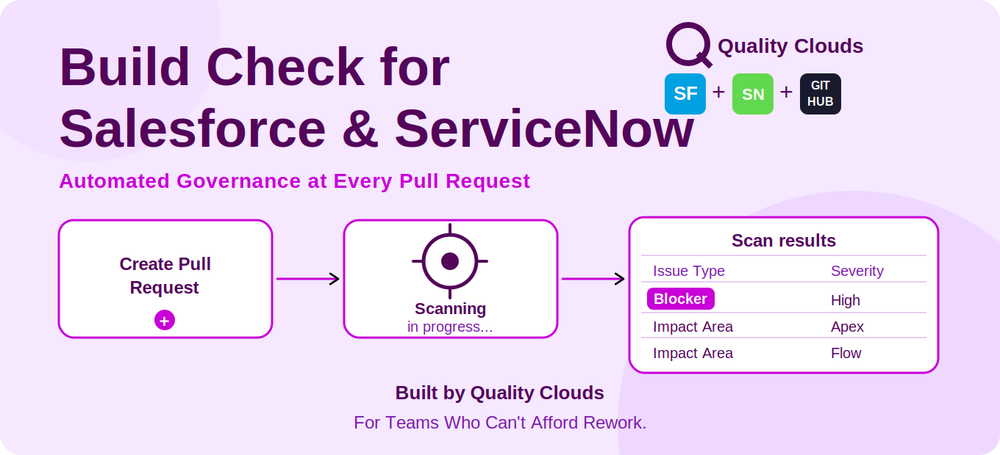

# action-full-scan

GitHub Action that scans your Salesforce or ServiceNow pull requests against Quality Clouds' governance, security, and platform-standard rules, with inline results.

## Install

```yaml
- name: Quality Clouds Scan
  uses: qualityclouds/action-full-scan@2.0.0
  with:
    mode: cloud
    token: ${{ secrets.QC_TOKEN }}
    review: true
    allIssues: true
    gitHubToken: ${{ secrets.GITHUB_TOKEN }}
    pr_fails_on_blockers: true
```

## Authentication

Requires a Quality Clouds license. Existing customers: generate an API key in the [Admin Portal](https://qualityclouds.com/documentation/qc/admin-portal-overview/administering-api-keys/) and store it as a repository secret. New to Quality Clouds: [get in touch](https://marketing.qualityclouds.com/meet-quality-clouds) to set up a plan for your team.

## What it does

| Input | Required | What it does |
|---|---|---|
| `token` | Yes | API key used to connect your Quality Clouds ruleset. |
| `mode` | No | `local` (default) scans a given zip file. `cloud` scans the branch the action runs on. |
| `cloud` | No | Set to `servicenow` for a ServiceNow repo. Defaults to Salesforce. |
| `zip_path` | No | Path to the zip file to scan. Only used in `local` mode. |
| `review` | No | Set `true` to add inline PR comments. Only used in `cloud` mode. |
| `allIssues` | No | Set `true` to show blockers and non-blockers. Only used in `cloud` mode. |
| `codequality` | No | Set `true` to generate a code-quality JSON report. Only used in `local` mode. |
| `gitHubToken` | No | Required if `review` is `true`. |
| `pr_fails_on_blockers` | No | Required if `review` is `true`. Fails the PR check when the Quality Gate doesn't pass. |

## Links

- Product: [qualityclouds.ai](https://qualityclouds.ai)
- Documentation: [qualityclouds.com/documentation](https://qualityclouds.com/documentation/)
- Questions and bugs: [community](https://github.com/qualityclouds/community/discussions)

## License

[Apache-2.0](LICENSE)

---

Built by [Quality Clouds](https://qualityclouds.ai), governing enterprise platforms since 2015.
